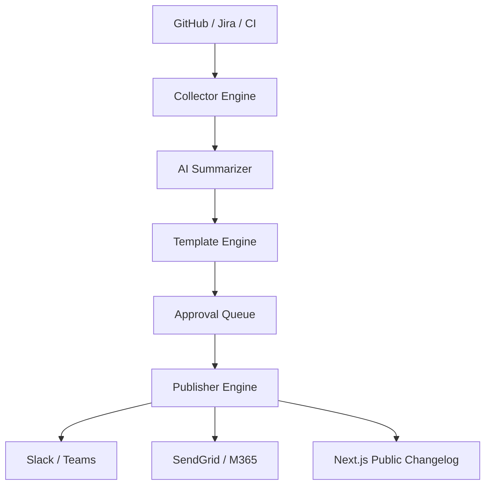
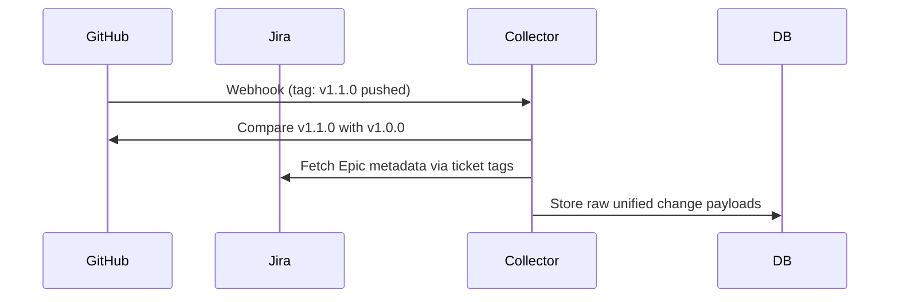
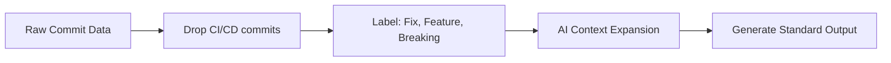
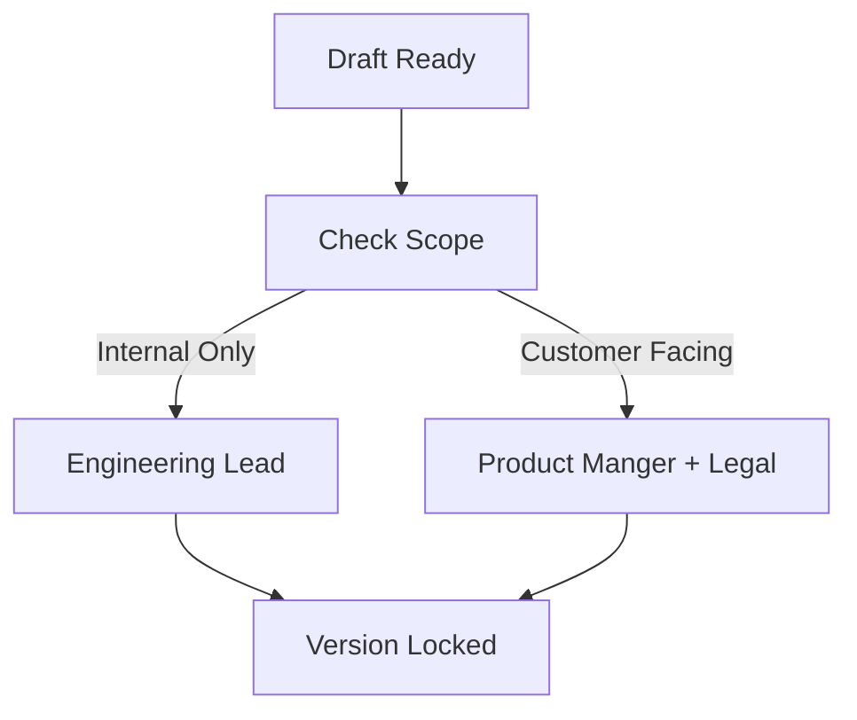
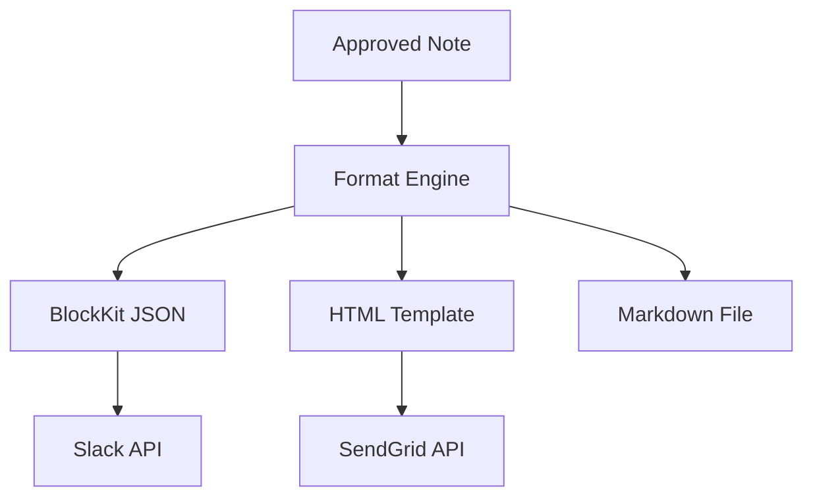
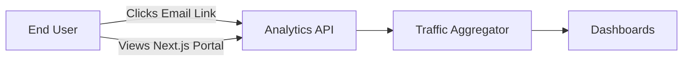
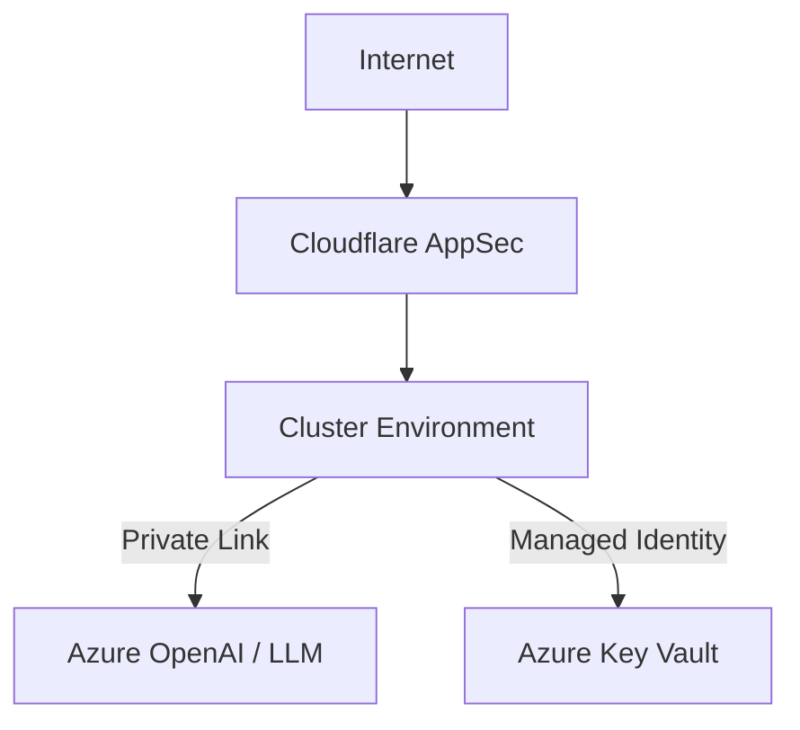
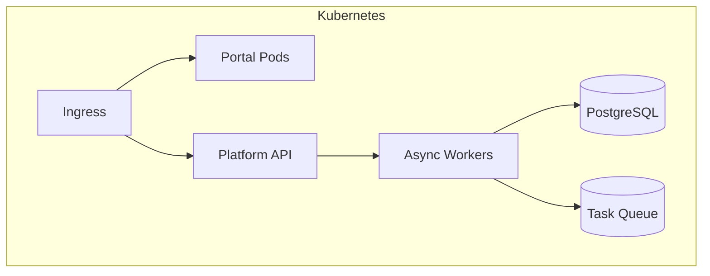
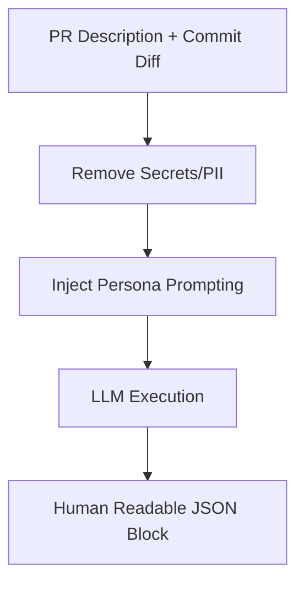
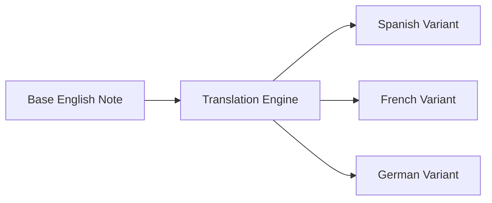

<div align="center">


<h1>Automated Release Notes Platform</h1>

<p><strong>Intelligent Change Synthesis, Broadcast Automation, and Executive Delivery Visibility</strong></p>

[](https://devopstrio.co.uk/)
[](/connectors)
[](/apps/publisher-engine)
[](https://devopstrio.co.uk/)

</div>

---

## 🏛️ Executive Summary

The **Automated Release Notes (ARN)** platform replaces the tedious, error-prone manual labor of compiling changelogs. By hooking directly into GitHub Pull Requests, Jira Tickets, and Kubernetes deployments, ARN automatically synthesizes dense technical diffs into polished, boardroom-ready announcements. 

Utilizing an integrated AI Subsystem, it detects Breaking Changes, identifies Feature categorizations, and broadcasts multi-channel updates targeting both internal Engineers (via Slack) and external Customers (via Email / Public Portal).

### Strategic Business Outcomes
- **Zero-Touch Publishing**: Deployments to Production trigger Webhooks that automatically generate and broadcast Release Notes within minutes of stabilization.
- **AI Tone Adaptation**: Automatically translates cryptic commit messages (`fix: null ref in payment handler`) into empathetic, customer-facing prose (`Resolved an issue preventing successful checkout experiences`).
- **Omnichannel Distribution**: A single release payload is dynamically adapted into Markdown for GitHub Releases, HTML for Email/Confluence, and BlockKit JSON for Slack channels.
- **Audit Defensibility**: Automatically binds the Release Note document to the exact Git SHA, Jira Epics, and Azure Pipeline Run IDs for SOC2 change-management compliance.

---

## 🏗️ Technical Architecture Details

### 1. High-Level Architecture


### 2. Change Data Collection Workflow


### 3. Release Note Generation Lifecycle


### 4. Approval Workflow


### 5. Multi-Channel Publish Flow


### 6. Engagement Analytics Flow


### 7. Security Trust Boundary


### 8. AKS Topology


### 9. AI Content Generation Model


### 10. Translation Workflow


---

## 🛠️ Global Platform Components

| Engine | Directory | Purpose |
|:---|:---|:---|
| **Release Portal**| `apps/portal/` | The Next.js Public Changelog and internal Dashboard. |
| **Collector API** | `apps/collector-engine/`| Webhook listeners aggregating state from external dev tools. |
| **AI Summarizer** | `ai/` | Handles the linguistic transformation from tech to business speak. |
| **Publisher** | `apps/publisher-engine/`| Dispatches the final payloads into Slack, Teams, and standard email. |

---

## 🚀 Environment Deployment

Deploy the infrastructure.

```bash
cd terraform/environments/prod
terraform init
terraform apply -auto-approve
```

---
<sub>&copy; 2026 Devopstrio &mdash; Engineering Empathic Communication.</sub>
